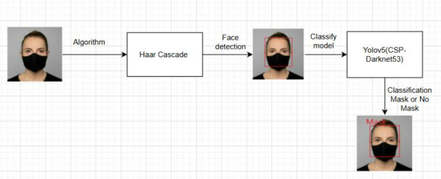

# Face Mask Detection in terminal area of manufacturing plant
## Architecture

## Method
Classification model:
- Yolov5 classify backbone(cspdarknet53)

Face detection model:
- Face detection: Haarfeature algorithm(Opencv)

Runtime system:
- Running realtime on CPU-System with onnx format

More information:
https://docs.ultralytics.com/models/yolov5/
